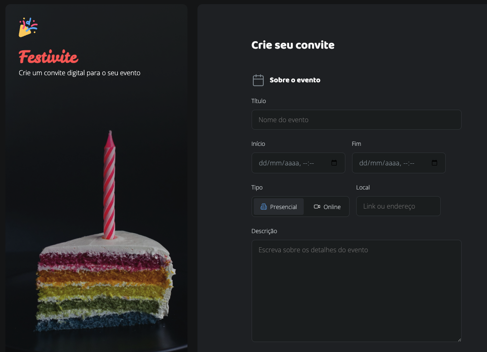

<h1 align="center">🧾 Formulários & Estilização de inputs com CSS</h1>

  Projeto de prática focado em diversos tipos de inputs HTML e seletores úteis de CSS para estilização dinâmica com responsividade.

  <a href="#-tecnologias">Tecnologias</a>&nbsp;&nbsp;&nbsp;|&nbsp;&nbsp;&nbsp;
  <a href="#-projeto">Projeto</a>&nbsp;&nbsp;&nbsp;|&nbsp;&nbsp;&nbsp;
  <a href="#-aprendizados">Aprendizados</a>&nbsp;&nbsp;&nbsp;|&nbsp;&nbsp;&nbsp;
  <a href="#memo-licença">Licença</a>

 

  

## 🚀 Tecnologias

Esse projeto foi desenvolvido com:

- HTML5
- CSS3
- Figma
- VSCode

## 💻 Projeto

Este projeto tem como objetivo consolidar meu conhecimento em **formulários HTML** e **seletores modernos de CSS**. Nele, criei um formulário completo com diferentes tipos de inputs e testei estilos interativos usando seletores como `:focus`, `:has()` e o uso de `&` em pré-processadores.

👉 **Você pode acessar o projeto online aqui:**  
[https://delquiare.github.io/Formulario-de-Convite](https://delquiare.github.io/Formulario-de-Convite/)

## 📚 Aprendizados

Neste projeto, explorei:

### 📥 Elementos de Formulário HTML
- `input` com diferentes `type`: `text`, `password`, `email`, `number`, `color`, `hidden`, etc.
- `textarea` para textos longos
- `checkbox` e `radio` para seleções
- `select` com opções e agrupamentos (`optgroup`)
- `label` para melhorar a acessibilidade
- `fieldset` e `legend` para organizar o formulário

### 🎨 Seletores CSS
- `input:focus` para destacar campos quando em foco
- `:has()` para aplicar estilos com base em elementos filhos (CSS relacional)
- `&` para estilização contextual (usado com pré-processadores como SCSS)

## :memo: Licença

Esse projeto está sob a licença MIT.  
Feito por mim com 💻 e curiosidade durante o aprendizado de front-end!
